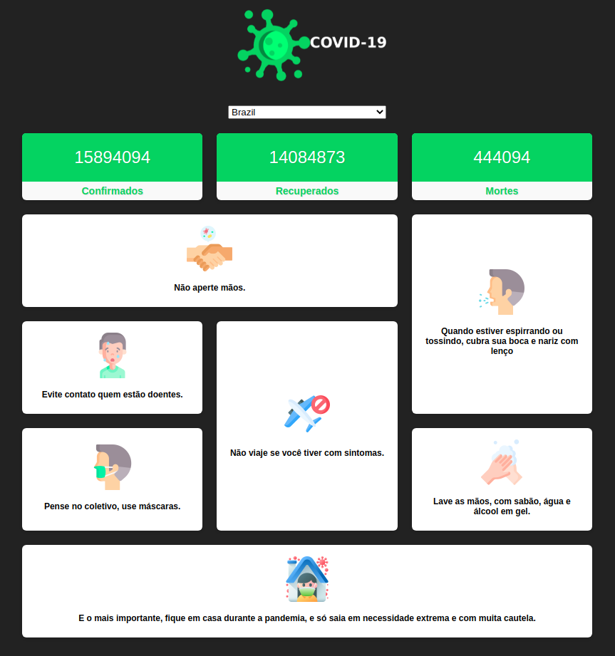

Projeto <strong>COVID-19</strong> desenvolvido a fim de testar a API de informações do coronavírus 😷

  <a aria-label="Palamar" href="https://github.com/aleksanderpalamar/">
    </img>
  </a>
  <a aria-label="Node" href="https://github.com/nodejs/node/blob/master/doc/changelogs/CHANGELOG_V14.md#14.17.0">
    </img>
  </a>
  <a aria-label="Next" href="https://nextjs.org/blog/next-9.3.2">
    </img>
  </a>

  <a href="#-instalação-e-execução">Instalação e execução</a>&nbsp;&nbsp;&nbsp;|&nbsp;&nbsp;&nbsp;
  <a href="#-como-contribuir">Como contribuir</a>&nbsp;&nbsp;&nbsp;|&nbsp;&nbsp;&nbsp;
  <a href="#memo-licença">Licença</a>

## -> Instalação e execução

1. Abra o terminal do seu computador. Se estiver no Windows, pode ser o Prompt de Comando ou PowerShell. Caso use o WSL no Windows, use o Windows Terminal, usando o Ubuntu ou qualquer distribuição suportada pelo WSL. 
2. Altere o diretório de trabalho atual para o local em que deseja ter o código do módulo salvo no seu computador.
3. Faça um clone desse repositório rodando:   `git clone https://github.com/aleksanderpalamar/covid-19`;
4. Entre na pasta rodando pelo terminal: `cd covid-19`;
5. Rode `yarn` ou `npm i` para instalar as dependências do projeto;
6. Rode `yarn start` ou `npm start` para iniciar o servidor de desenvolvimento.

## -> Como contribuir

Se quiser contribuir para esse repositório aqui, seja para corrigir algum bug ou até mesmo adicionando comentários afim de melhorar a documentação, você pode seguir esse tutorial abaixo:

- Faça [um fork](https://help.github.com/pt/github/getting-started-with-github/fork-a-repo) desse repositório;
- Entre no seu perfil no GitHub e faça um clone do repositório que você fez um *fork*;
- Crie uma *branch* com a sua alteração: `git checkout -b minha-alteracao`;
- Faça as alterações necessárias no código ou na documentação;
- Faça *commit* das suas alterações: `git commit -m 'feat: Minha nova feature'`;
- Faça *push* para a sua *branch*: `git push origin minha-alteracao`;
- Agora é só abrir a sua *pull request* no repositório que você fez o *fork*;

Depois que o *merge* da sua *pull request* for feito, você pode deletar a sua *branch*.

## Licença

Esse projeto está sob a licença MIT. Veja o arquivo [LICENSE](LICENSE.md) para mais detalhes.

---
Feito com ♥ by Aleksander Palamar [Site](https://palamarsolutionit.com.br/).
